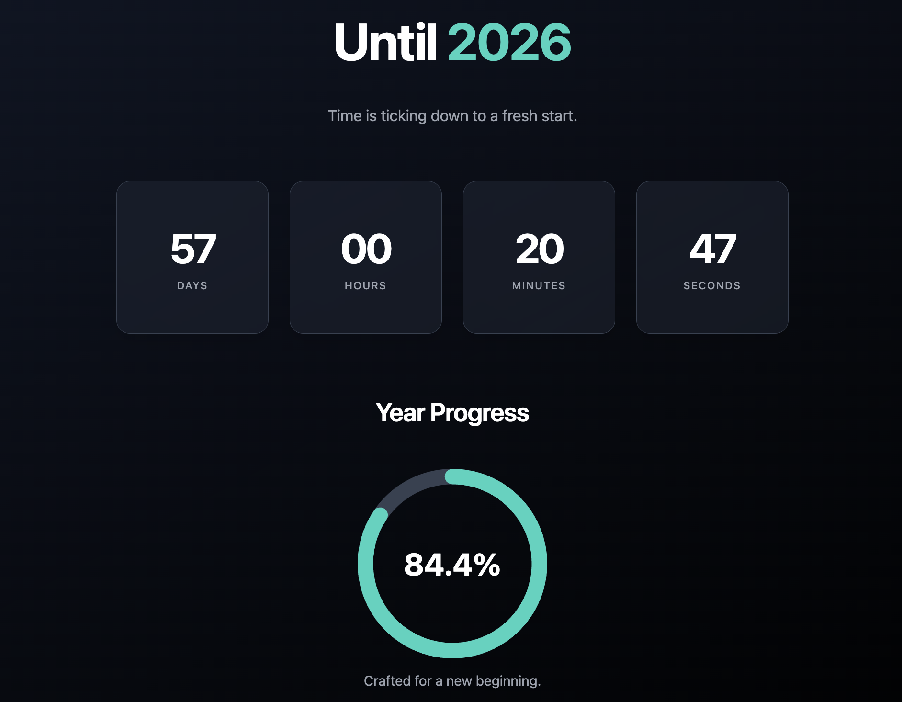

# New Year Countdown & Progress (https://timeleft-dusky.vercel.app/)

A sleek, single-page web application that displays a real-time countdown to the next new year and a circular progress bar visualizing the percentage of the current year that has elapsed. This project is built with pure HTML, CSS, and JavaScript, with no external frameworks or libraries, making it lightweight, fast, and easy to understand.

*(Image is a placeholder representation)*

---

## ✨ Features

- **Real-Time Countdown**: Displays the remaining days, hours, minutes, and seconds until the next year begins. The timer updates every second.
- **Year Progress Visualization**: A beautiful circular progress bar that dynamically shows how much of the current year has been completed.
- **Responsive Design**: The layout is fully responsive and looks great on devices of all sizes, from mobile phones to desktop monitors.
- **Zero Dependencies**: Built entirely with vanilla HTML, CSS, and JavaScript. No frameworks, no libraries, no build steps required.
- **Modern UI**: A clean, dark-themed interface with smooth transitions and a focus on readability.
- **Self-Contained**: All necessary code (HTML, CSS, JS) is in a single `index.html` file, making it incredibly portable and easy to deploy.

---

## 🚀 How to Use

Getting started is as simple as it gets:

1.  **Download the Code**: Clone this repository or simply download the `index.html` file.
2.  **Open in Browser**: Open the `index.html` file in any modern web browser (like Chrome, Firefox, Safari, or Edge).

That's it! The countdown will start immediately.

---

## 🛠️ Technologies Used

-   **HTML5**: For the structure and content of the web page.
-   **CSS3**: For all styling, layout, and animations.
-   **JavaScript (ES6+)**: For the countdown logic, date calculations, and DOM manipulation.

---

## 📂 Code Overview

The entire application is contained within `index.html`. Here’s a brief breakdown of its structure:

### `<head>`
-   **Metadata**: Basic meta tags for character set and viewport settings.
-   **`<style>` tag**: Contains all the CSS for the application.
    -   **Basic Reset**: Simple reset for `body` margins and sets a global font.
    -   **Layout**: Uses Flexbox for centering and arranging content.
    -   **Component Styles**: Clear, class-based styles for the main title, countdown cards, progress circle, and footer.
    -   **Responsiveness**: Media queries are used to adjust font sizes and element dimensions for different screen sizes.

### `<body>`
-   **HTML Structure**: Semantic HTML is used to define the page structure, including `<main>` and `<footer>` sections.
    -   Elements are given unique `id`s (e.g., `days-left`, `progress-circle`) for easy selection with JavaScript.
-   **`<script>` tag**: Placed at the end of the `<body>`, this contains all the JavaScript logic.
    -   **`calculateAndRender()`**: This is the core function. It calculates the time difference between now and the next year, determines the year's progress percentage, and then calls `updateUI()` to refresh the display.
    -   **`updateUI()`**: This function selects all the necessary DOM elements by their ID and updates their `textContent` or `style` properties with the newly calculated values.
    -   **`main()`**: The entry point of the script. It calls `calculateAndRender()` once immediately and then sets up a `setInterval` to call it again every 1000 milliseconds (1 second) to keep the countdown live.
    -   The script waits for the `DOMContentLoaded` event to ensure all HTML elements are loaded before it runs.

---

## 📄 License

This project is open-source and available under the [MIT License](LICENSE).
